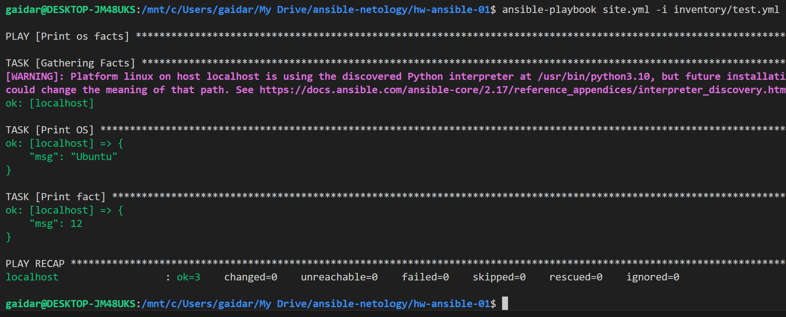
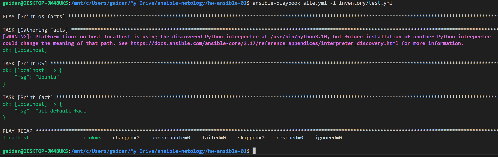
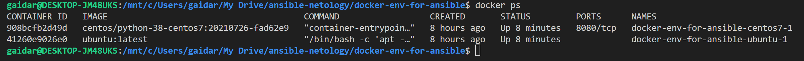
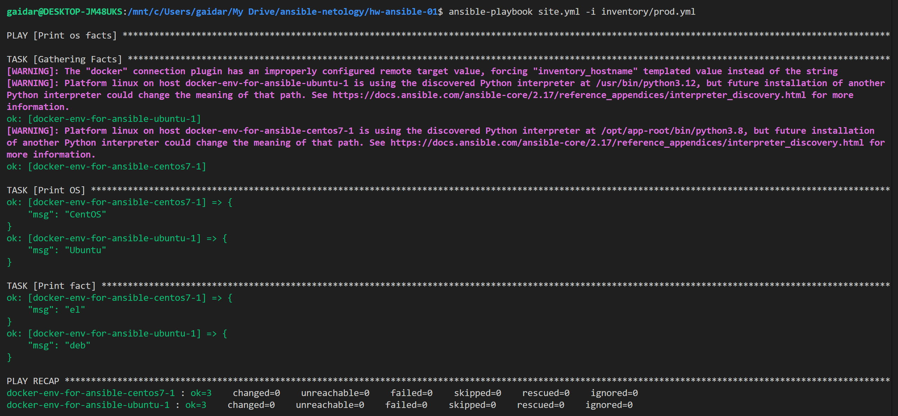
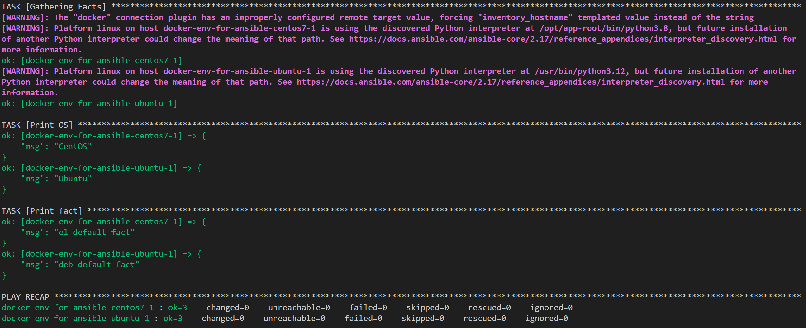
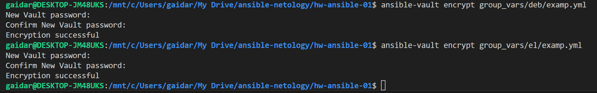
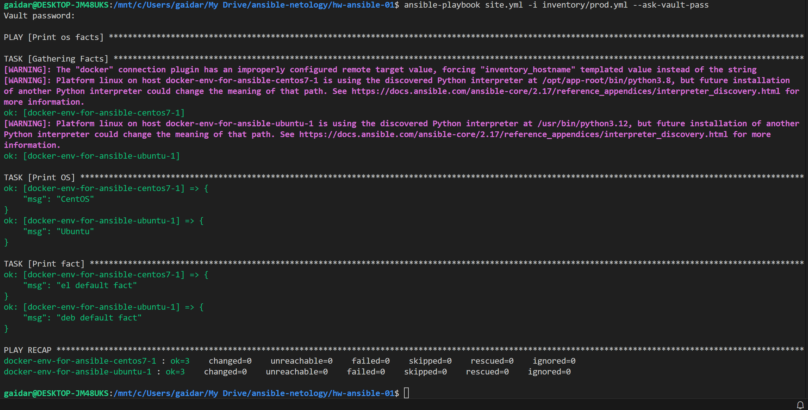
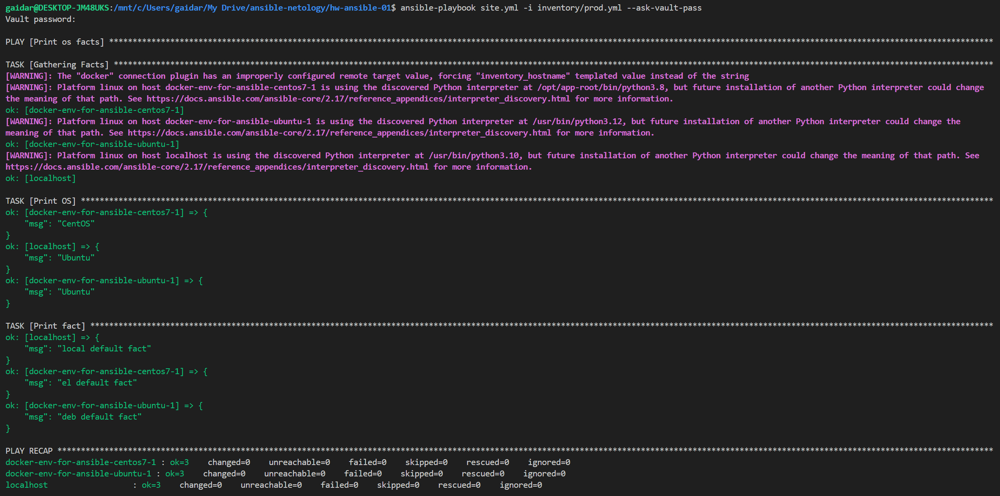

## Пункт 1

## Пункт 2

## Пункт 3

## Пункт 4

## Пункт 6

## Пункт 7

## Пункт 8

## Пункт 10

Я так и не понял, нужно-ли добавлять local в group_vars, но на всякий случай добавил, чтобы localhoct отрабатывал с нужным фактом (скриншот ниже).

## Пункт 11

## Итог
[Финальный код (ссылка на репозиторий)](https://github.com/gaidarvu/ansible-netology/tree/main/hw-ansible-01)
