# Домашнее задание к занятию 5 «Тестирование roles»

## Molecule

При запуске molecule test -s ubuntu_xenial для clickhouse видим следующие результаты:

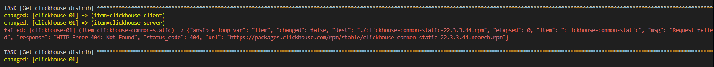

При запуске molecule test для Vector видим следующие результаты:

Роль Destroy

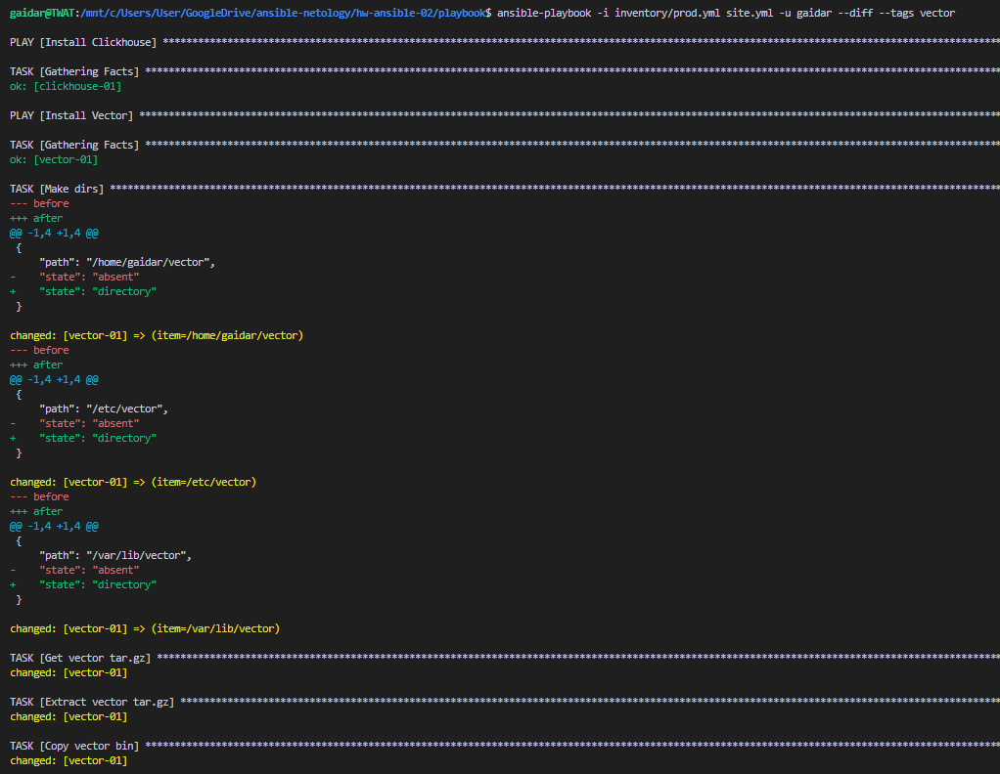

Создание тестовой среды

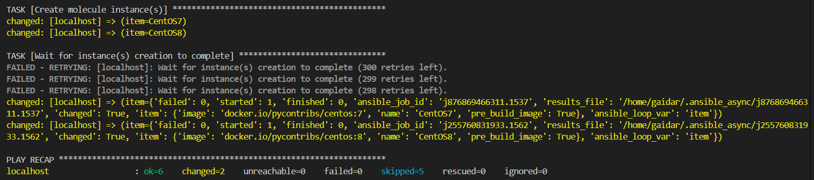

Развертывание роли в тестовую среду

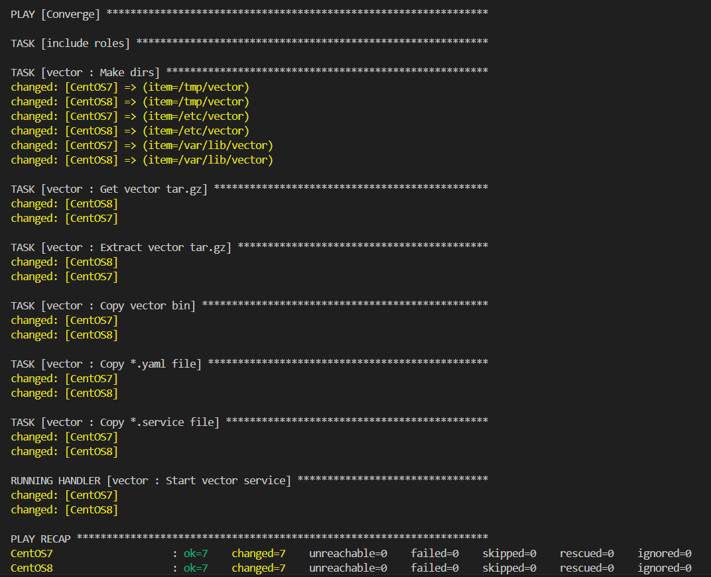

Тест на идемпотентность

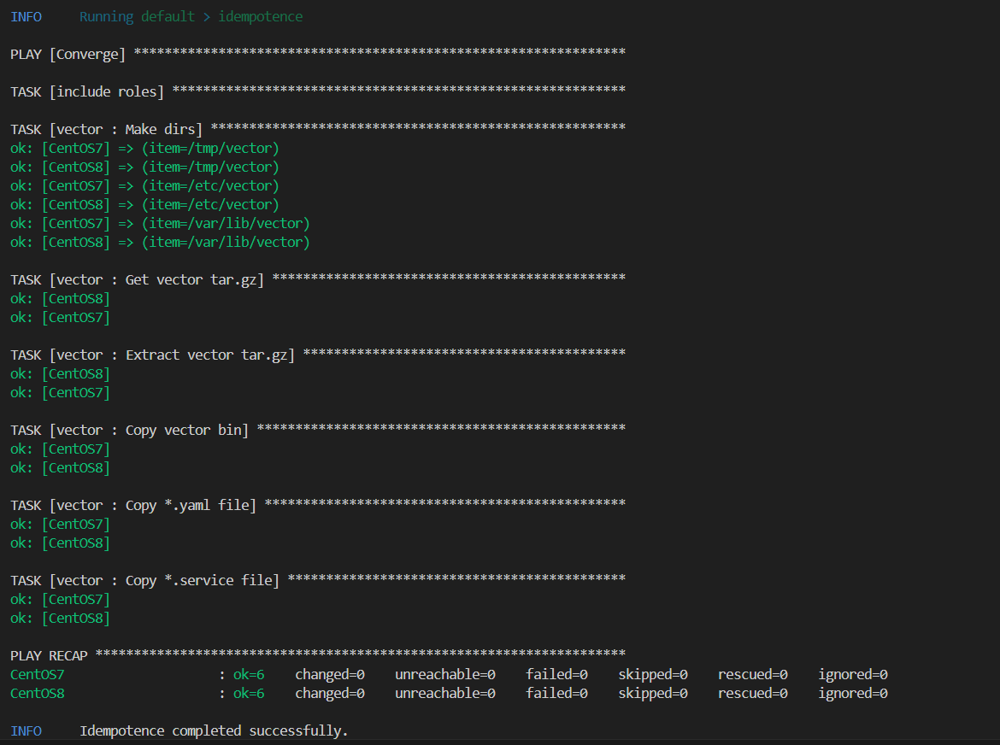

Тест verify

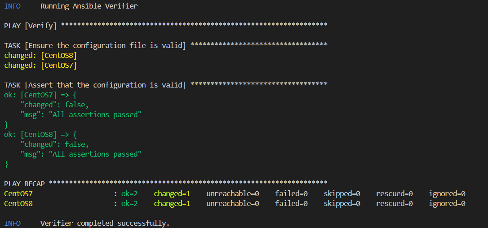

Очистка тестовой среды

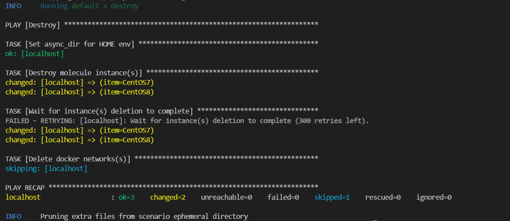

## Tox

Запуск tox происходит по сценарию: destroy --> create --> converge --> destroy
Тестовая среда driver: podman, image: python:latest

Запуск tox, роль destroy

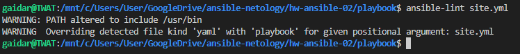

Роль create

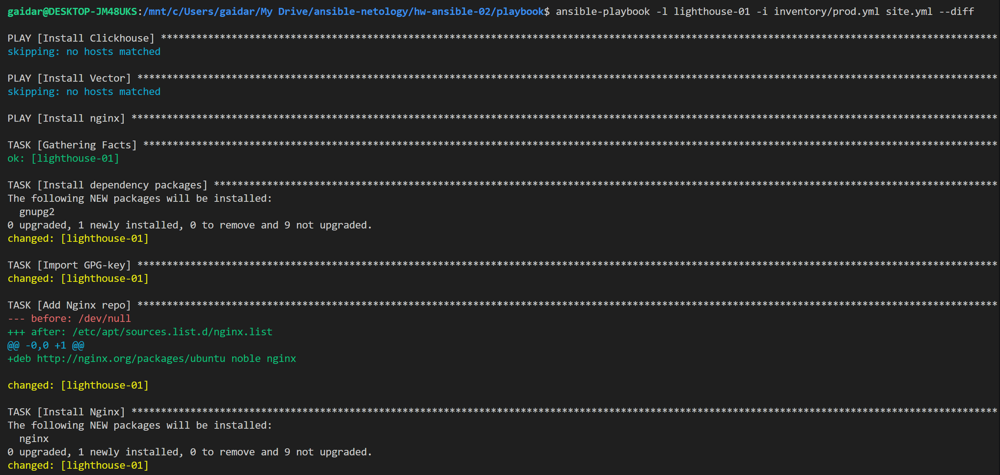

Роль converge

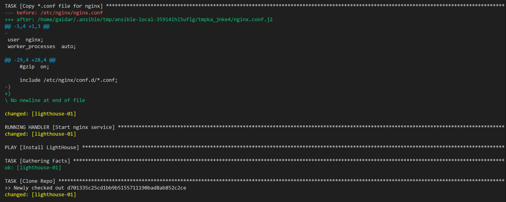

Роль destroy + info

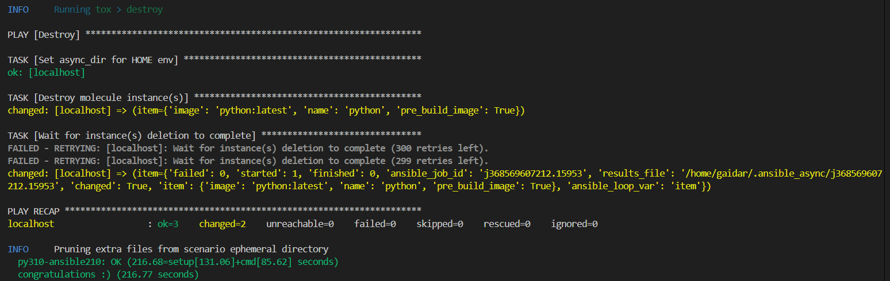

## Итог

[Репозиторий с тегом Molecule](https://github.com/gaidarvu/ansible-netology/tree/v1.0.0)

[Репозиторий с тегом Tox](https://github.com/gaidarvu/ansible-netology/tree/tox1.0.1)

[Финальный код (ссылка на репозиторий)](https://github.com/gaidarvu/ansible-netology/tree/hw-ansible-05)