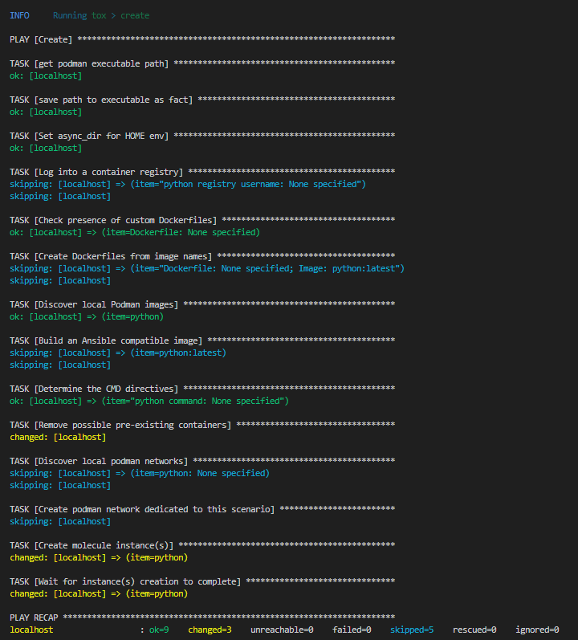

# Домашнее задание к занятию 3 «Использование Ansible»

## Описание плэйбука
Данный playbook выполняет развертывание в Yandex Cloud:

ClickHouse и Vector на хосты под управлением CentOS7
LightHouse на хост под управлением Ubuntu Server 20.04

В инвентори файле ./inventory/prod.yml добавлены необходимые хосты

Все таски разделены тэгами, чтобы можно было раскатывать их отдельно друг от друга.

Для создания базы данных clickhouse добавлено количество попыток для повторного запуска таска по причине того, что таск часто падает в ошибку, вероятно, из-за того, что служба clickhouse не успевает запуститься. Как показала практика, со второй попытки база данных создается успешно

## Версия

Пакеты Clickhouse v22.3.3.44

Vector-0.42.0 на данный момент последняя версия продукта

## Файлы конфигурации vector

Во время раскатки плэйбука для vector подкидываются темплейты конфига и службы с нужными переменными, необходимыми для функционирования приложения.

В папке ./template находятся jinja2 файлы конфигов

Переменные располагаются в ./vector/vars.yml

Файл конфига копируется в /etc/vector/vector.yaml

Сервис создается в /etc/systemd/system/vector.service

Бинарный файл vector копируется в /usr/bin/

## Файлы конфигурации LightHouse

Для LightHouse подкидываются конфиги nginx.

Переменные располагаются в ./lighthouse/vars.yml

Конфиг lighthouse для nginx копируется из ./template/default.conf.j2

Для LightHouse необходим Nginx

Для установки Nginx добавляю официальный репозиторий для текущей версии ОС.

Попутно ставятся зависимости, рекомендованные официальным порталом для установки.

Конфиг nginx копируется из ./template/nginx.conf.j2

В прошлом задании я демонстрировал скрины раскатки vector и clickhouse с флагом --diff, решил тут показать только lighthouse для читаемости ДЗ. Раскатка vector и clickhouse ничем не отличается от прошлого ДЗ.

Повторный запуск с флагом --diff

## Итог
[Финальный код (ссылка на репозиторий)](https://github.com/gaidarvu/ansible-netology/tree/08-ansible-03-yandex/hw-ansible-02/playbook)