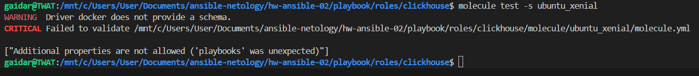
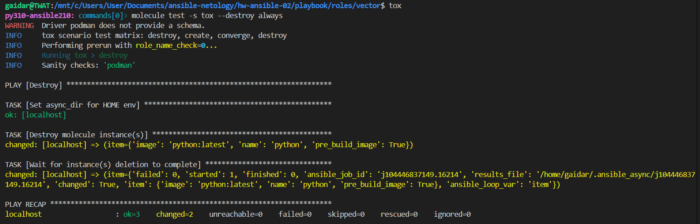

# Домашнее задание к занятию 2 «Работа с Playbook»

## Описание плэйбука
Данный playbook выполняет развертывание ClickHouse и Vector на хосты под управлением CentOS7

В инвентори файле ./inventory/prod.yml добавлены необходимые хосты

Таски ClickHouse и Vector разделены тэгами, чтобы можно было раскатывать их отдельно друг от друга.

Для создания базы данных clickhouse добавлен дополнительный тег make-db для отдельного запуска таска по причине того, что таск часто падает в ошибку, вероятно, из-за того, что служба clickhouse не успевает запуститься.

Вторым решением этой проблемы было добавить таск с задержкой выполнения следующих тасков для того чтобы служба смогла стартануть до конца. Тест показал, что этот вариант тоже рабочий:

```ansible
- name: Wait for service started
    ansible.builtin.pause:
      seconds: 10
```
# Версия

Пакеты Clickhouse v22.3.3.44

Vector-0.42.0 на данный момент последняя версия продукта

# Файлы конфигурации vector
Во время раскатки плэйбука для vector подкидываются темплейты конфига и службы с нужными переменными, необходимыми для функционирования приложения.

В папке ./template находятся jinja2 файлы конфигов

Переменные располагаются в ./vector/vars.yml

Файл конфига копируется в /etc/vector/vector.yaml

Сервис создается в /etc/systemd/system/vector.service

Бинарный файл vektor копируется в /usr/bin/

## Пункт 2

При выполнении плэйбука таск Get clickhouse distrib падает в ошибку из-за недоступности дистребутива, после чего подключается rescue который выкачивает нужный дистребутив и роль продолжается дальше



Роль завершается успешно со статусом rescued=1


## Пункт 5

Проверка ansible-lint


После исправления ошибок



## Пункт 6

При запуске плэйбука с флагом --check, ансибл иммитирует раскатку роли на хост. Например прогоняет таск создания каталогов, а по факту их не создает. Логично. Но при попытке симмитировать распаковку архива в каталог, который он не создал, роль падает в ошибку отсутствия каталога.
Если запустить плэйбук с этим флагом уже после того как роль была раскатана, всё проходит без ошибок


## Пункт 7

При запуске плэйбука с флагом --diff наглядно видны все изменения, которые вносит ансибл


## Пункт 8

При повторном запуске плэйбука с флагом --diff никаких изменений не вносится. Это и означает, что playbook идемпотентен.


## Итог
[Финальный код (ссылка на репозиторий)](https://github.com/gaidarvu/ansible-netology/tree/main/hw-ansible-02/playbook)