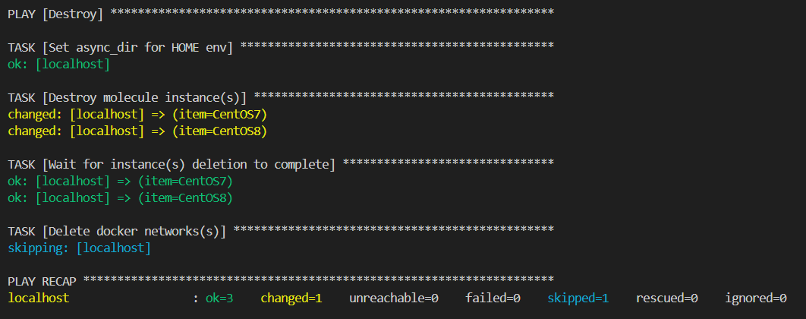

# Домашнее задание к занятию 5 «Тестирование roles»

## Molecule

При запуске molecule test -s ubuntu_xenial для clickhouse видим следующие результаты:

При запуске molecule test для Vector видим следующие результаты:

Роль Destroy

Создание тестовой среды

Развертывание роли в тестовую среду

Тест на идемпотентность

Тест verify

Очистка тестовой среды

## Итог

[Репозиторий Vector](https://github.com/gaidarvu/vector-role/tree/v1.1.0)

[Репозиторий LightHouse](https://github.com/gaidarvu/lighthouse-role/tree/v1.2.1)

[Репозиторий Nginx](https://github.com/gaidarvu/nginx-role/tree/v1.1.0)

[Финальный код (ссылка на репозиторий)](https://github.com/gaidarvu/ansible-netology/tree/hw-ansible-04/hw-ansible-02/playbook)