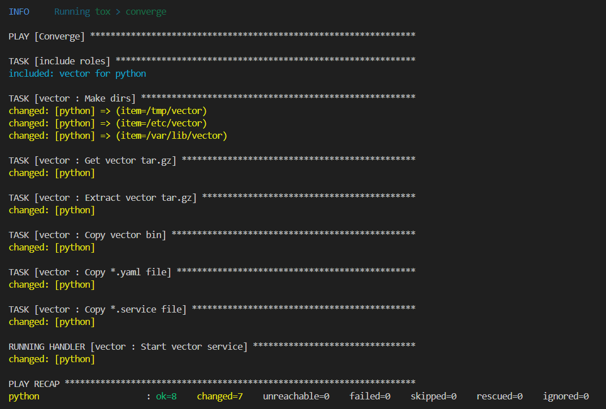

# Домашнее задание к занятию 5 «Тестирование roles»

## Molecule

При запуске molecule test -s ubuntu_xenial для clickhouse видим следующие результаты:

При запуске molecule test для Vector видим следующие результаты:

Роль Destroy

Создание тестовой среды

Развертывание роли в тестовую среду

Тест на идемпотентность

Тест verify

Очистка тестовой среды

## Tox

Запуск tox происходит по сценарию: destroy --> create --> converge --> destroy
Тестовая среда driver: podman, image: python:latest

Запуск tox, роль destroy

Роль create

Роль converge

Роль destroy + info

## Итог

[Репозиторий с тегом Molecule](https://github.com/gaidarvu/ansible-netology/tree/v1.0.0)

[Репозиторий с тегом Tox](https://github.com/gaidarvu/ansible-netology/tree/tox1.0.1)

[Финальный код (ссылка на репозиторий)](https://github.com/gaidarvu/ansible-netology/tree/hw-ansible-05)